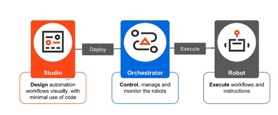

# Notes on UiPath Core RPA Components

- **Studio**: The development environment where automations are created. It provides a user-friendly interface for designing, building, and testing RPA workflows.
- **Orchestrator**: The web-based application used to manage, schedule, monitor, and deploy automation processes and robots. It acts as the central hub for controlling the RPA ecosystem.
- **Robots**: The agents that execute the automation workflows built in Studio. Robots can run attended (with human interaction) or unattended (fully automated) processes.

These are called the core components of the UiPath Platform because RPA cannot function without the ability to develop automations (Studio), execute them (Robots), and manage the entire automation ecosystem (Orchestrator).

## Studio

UiPath Studio is an integrated development environment for Automation Developers to design, develop, and debug automation projects.

Studio can be connected to Orchestrator, making it easy to publish automation projects as NuGet packages, via the dedicated feeds. From there, they're distributed to robots to be executed.

When we say Studio, we can think of three profiles, namely Studio Web, StudioX, and Studio.

These are meant to match different coding skills that developers may have:

- **Studio Web** occupies a unique position within the Studio family as the only cloud-based product, serving as the entry point into the world of automation. It's the perfect choice for individuals new to automation or those looking for a user-friendly experience.
- **StudioX** is meant for business users looking to automate tasks for themselves and their immediate teams.
- **Studio** is meant for Automation developers looking to build complex unattended or attended process automations.

Depending on the type of Studio license an enterprise may purchase, Studio users can switch between Studio and StudioX profiles as they need.

## Orchestrator

Orchestrator, the heart of automation management, is a web application that allows managing, controlling, and monitoring the robots and the automations.

With Orchestrator, we can deploy, trigger, measure, provision, track, and ensure the security of every robot in the organization.

Orchestrator also functions as a repository for libraries, reusable components, assets, and processes used by robots or by developers.

The main capabilities of Orchestrator are:

- **Provisioning**: Creates and maintains the connection with robots.
- **Control and license distribution**: Enables the creation, assignment, and maintenance of licenses, roles, permissions, groups, and folder hierarchies.
- **Automation storage and distribution**: Allows the controlled storage and distribution of automation projects, assets, and credentials, as well as large files used in automations.
- **Running automation jobs in unattended mode**: Enables the creation and distribution of automation jobs in various ways, including through queues and triggers.
- **Monitoring**: Allows monitoring of jobs and robots and stores logs for auditing and analytics.
### Robots

A software robot is an execution agent that runs automations built with the Studio family and then published as packages either locally or to Orchestrator.

There are two types of UiPath robots, and they differ both in the way they work and in the way they're licensed:

#### Attended Robots
- They're digital helpers for human users. They work on the same machines as us humans, during the same hours.
- They're triggered directly by humans (usually through UiPath Assistant) or by an event related to what the human user does. For example, opening an application or receiving an email.
- **UiPath Assistant** is the component that provides a friendly interface to interact with attended robots. It is the tool that we use to easily access, manage, and run automations. 

#### Unattended Robots
- These are meant to work non-stop, with as little input from human users as possible.
- They're deployed on separate machines, and their jobs are triggered exclusively from Orchestrator.
- Their interactions with human users are typically handled with as little disruption as possible, by creating and sending requests for human input or validation as tasks.
- While these await to be processed, unattended robots can continue their work by picking up other jobs.
- When human input is finally provided, unattended robots can resume their work on the process.

#### Automation Cloud Robots
Automation Cloud Robots (ACRs) are SaaS robots hosted in the UiPath Automation Cloud that let you quickly run automations without building or managing your own unattended Robot infrastructure. They come in two flavors:
- **VM Automation Cloud Robots**: Access to a fully customizable Windows virtual machine and set up UiPath Robots to run any job in a matter of minutes.
- **Serverless Automation Cloud Robots (Linux-based cloud robots)**: Run background, cross-platform projects easily without worrying about infrastructure setup. UiPath takes care of everything—infrastructure, and robots.

#### Test Robots
These robots can be deployed to execute tests on-demand, continuously, and at scale. Here are some of the characteristics of a test robot:
- Purpose-built for testing workflows, activities, and applications.
- Provides flexibility in managing and reusing test cases across projects.
- Enables activity-level unit testing out-of-the-box.

## Running Your First Process with UiPath

# 🤖 UiPath Automation Projects

Welcome to the **UiPath Automation Repository**. This collection includes end-to-end RPA solutions developed using UiPath Studio to automate real-world business tasks such as invoice processing, email handling, web data extraction, and more.

